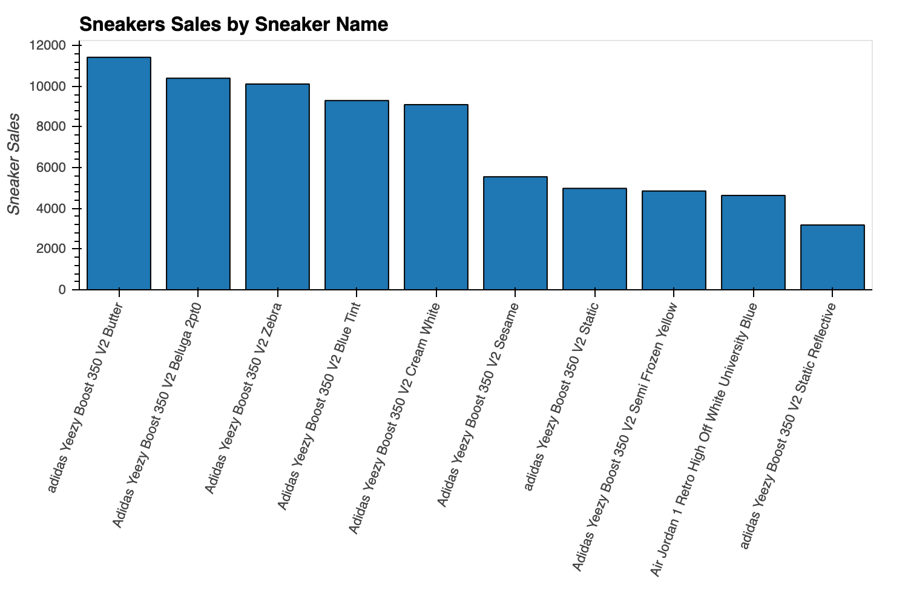
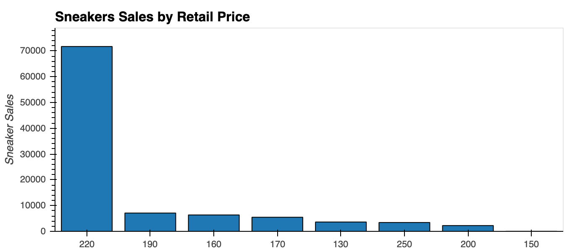
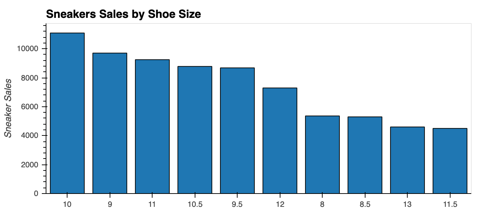
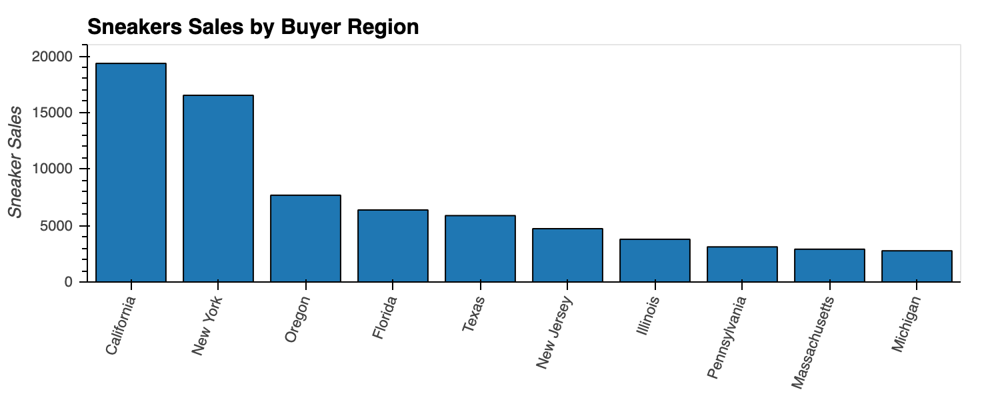
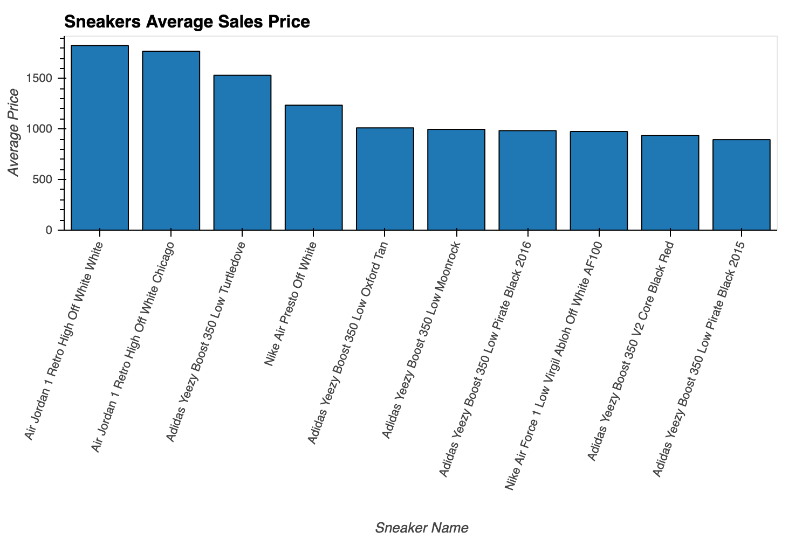
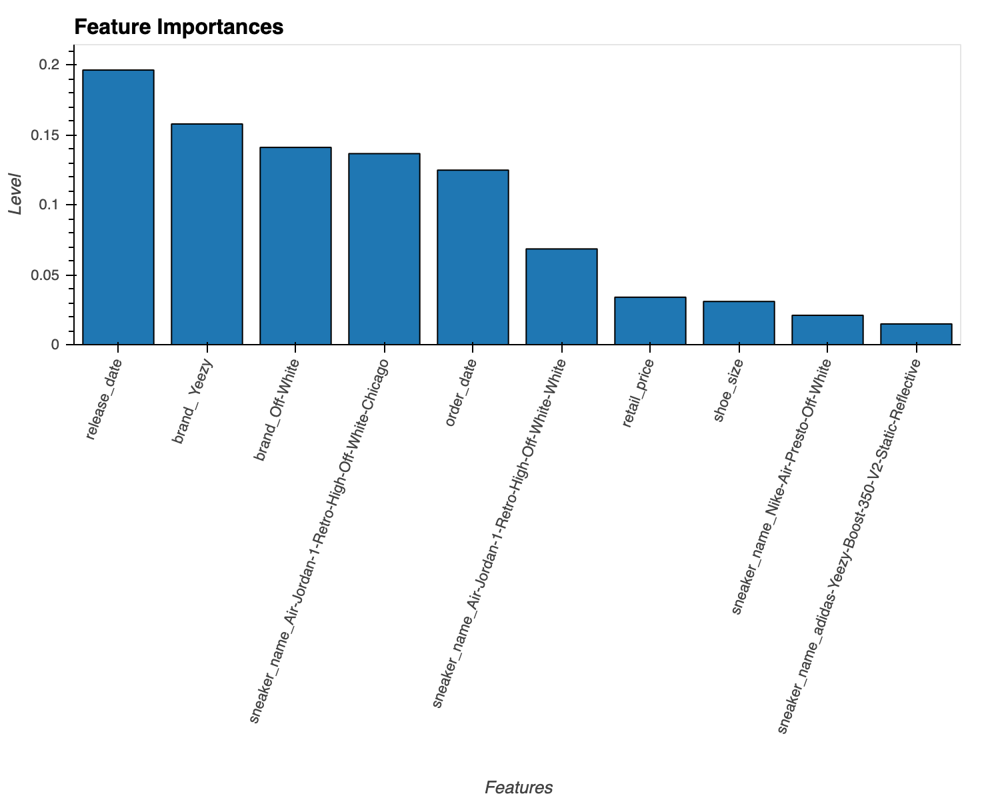
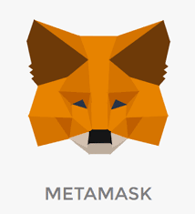
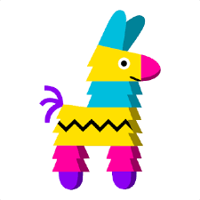

## Table of Contents

* [Summary](#summary)
* [Market Analysis and Modeling](#market-analysis-and-modeling) 
* [Development Platforms](#development-platforms)
* [Blockchain Technology](#blockchain-technology) 
* [Smart Contracts](#smart_contracts) 
* [Digital Tokens - Non-Fungible Tokens(NFT)](#digital-tokens-non-fungible-tokens(NFT)) 
* [Initial Coin Offering (ICO)](#initial-coin-offering-(ICO)) 
* [Demo](#demo)
* [Collaborators](#collaborators)
* [Resources](#resources)


---
## Summary

---

## Market Analysis and Modeling
Using the dataset provide by StockX we evaluated the different aspects of the sneakers resale market and develop a regression model to predict resale price identify the most relevant features of the sneakers market. 















### Parameters
```python
# Define features set
X = df.drop(['sale_price'], axis=1)

# Define target vector
y = df.sale_price

# Encoding variables
X = pd.get_dummies(X, columns=["brand", "sneaker_name", "buyer_region"])
X.head()

# Splitting into Train and Test sets
X_train, X_test, y_train, y_test = train_test_split(X, y, test_size=0.2, random_state = 27)

# Create the random forest regresor instance
rf_model = RandomForestRegressor(n_estimators=500,random_state=27)
```

### Results
```python
R²: 0.98
Mean Absolute Error: 14.49
Median Absolute Error: 7.10
Accuracy: 97.14%
```


---
## Development Platforms






---
## Blockchain Technology

---
## Smart Contracts

---
## Digital Tokens - Non-Fungible Tokens (NFT)

---
## Initial Coin Offering (ICO)

---
## Demo 

---
## Collaborators
- Emmanuel Lopez els2310@gmail.com 
- Etienne Alcaraz etiennegalcaraz@gmail.com
- Jerry Hsieh cthsieh@ucdavis.edu
- Sylvia 

---
## Resources
- [Random Forest Regression](MarketAnalysis/notebooks/Random_Forest_Regression.ipynb)
- [Sneakers Analysis](MarketAnalysis/notebooks/Sneakers_Data_Analysis.ipynb)
- [StockX Data Contest](https://stockx.com/news/the-2019-data-contest/)

